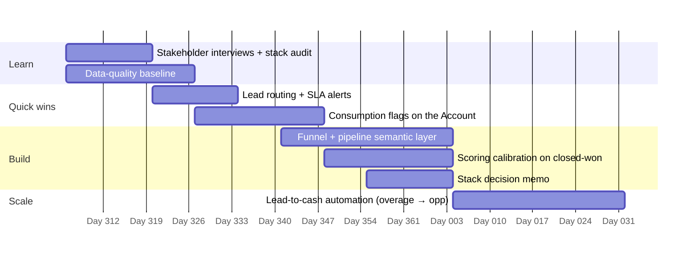

# First 90 Days: Revenue Operations Manager, Sardine

One role, both tracks: RevOps (🟩 pipeline, forecast, consumption, renewals) and internal GTM Engineering (🟦 signals, enrichment, scoring, routing, automation). The plan follows the posting's own bias: **prototype first, document second**, and ship something useful every two weeks.

## Days 1–30: learn the machine, fix what's bleeding

| Goal | Concrete output |
|---|---|
| Understand how revenue actually flows | 1:1s with the Global Head of Revenue, sales leaders (NA, EU/UK, MENA, LATAM, crypto, federal), Marketing, Post-Sales/CS, Finance and Solutions. Each gets one question: what do you do by hand every week that you hate? |
| Audit the stack | Fill in the [stack evaluation](shared_core/context/gtm-stack-evaluation.md) scorecard: cost, adoption, API surface and overlap for Salesforce, HubSpot, Unify, Clay, n8n and ZoomInfo |
| Baseline data quality | Run the [data-quality rules](shared_core/data_quality/dq_monitor.py) against the real org; publish the pass rate per rule with an owner for each |
| Agree definitions | One page of definitions (MQL, SQL, pipeline, commit, NRR on billed revenue), signed off by Sales, Marketing and Finance. Start from [metric definitions](shared_core/metrics/metric-definitions.md) |
| First quick win | Speed-to-lead: routing plus SLA alerts on high-intent leads (demo request, chat, regulatory trigger) |
| Know what Sales leadership needs | [VP of Sales intake](gtm_strategy_ops/sales_leadership/vp-intake.md) in the first 1:1 (snapshot or full, when, which definitions); first weekly [brief](gtm_strategy_ops/sales_leadership/vp_brief.py) by week 3 |
| Agree the line with Marketing Ops | [Who-owns-what](gtm_engineer/marketing_ops/README.md#who-owns-what) and week-one questions; one [request queue](gtm_strategy_ops/sales_planning/crm-request-intake.md) for Salesforce and HubSpot |

## Days 31–60: build the shared foundation

| Goal | Concrete output |
|---|---|
| One source of truth for the funnel | A warehouse semantic layer that every dashboard reads ([pattern](shared_core/metrics/sql/semantic_layer.sql)); lead-to-opp, pipeline coverage and win-rate dashboards on top of it |
| Consumption visibility in the CRM | Commit, 3-month usage, utilization and a consumption flag on every Account ([lead-to-cash](gtm_strategy_ops/consumption/lead-to-cash.md)); a weekly overage and shelfware list sent to owners |
| Scoring that predicts | Calibrate fit × intent on Sardine's closed-won history ([calibrate_scoring.py](gtm_engineer/lead_scoring/calibrate_scoring.py)); agree new weights with Marketing and Sales |
| Stack decision memo | Keep / consolidate / replace, with cost and a migration order |
| Stage history and slippage | Field history on StageName and CloseDate; [stage velocity](gtm_strategy_ops/sales_leadership/stage_velocity.py) and the deal board live for the forecast call |
| Demand plan with Marketing | Source mix and leads-by-channel targets for next quarter ([demand plan](gtm_engineer/marketing_ops/demand_plan.py)) |

## Days 61–90: automate and hand over

| Goal | Concrete output |
|---|---|
| Lead-to-cash automation | Overage above threshold creates an expansion opp; shelfware after ramp creates a CSM adoption task; renewal opps pre-filled with trailing usage |
| AI workflows in production, with guardrails | Account-research briefs and deal-risk commentary behind human review, with evals in CI ([AI governance](shared_core/ai_governance/README.md)) |
| Forecast hygiene | A weekly forecast cadence with commit accuracy and bias by region ([forecast_accuracy.py](gtm_strategy_ops/forecasting/forecast_accuracy.py)) |
| Planning ready for next year | [Capacity and hiring plan, quota vs capacity, territory balance](gtm_strategy_ops/sales_planning/README.md) on real productivity and ramp history |
| Make it last | Every automation documented in Git with an owner and a runbook; a quarterly review of the stack scorecard |

## How I'd measure the first 90 days

- Speed-to-lead on high-intent leads (median minutes)
- Data-quality pass rate on the 16 rules, and the trend
- Share of Accounts with consumption fields populated
- Overage-sourced expansion pipeline created
- Hours of manual work removed per week, as reported by the teams that did it
