# Sardine GTM RevOps Toolkit

**One revenue engine, one owner, lead to cash.** A working toolkit built against Sardine's [Revenue Operations Manager](https://jobs.ashbyhq.com/sardine/b6ca1fd5-a374-4c99-a6fd-a0c4d0859a61) role. The posting puts that role "at the intersection of Revenue Operations and GTM Engineering", so this repo covers both: the signal-to-SQL engine, the pipeline-to-renewal operation, and the consumption revenue in between that a usage-priced company has to watch every month.


> All accounts, people and numbers in `sample_data/` are synthetic. Sardine facts come from public sources and are cited in the [company brief](shared_core/context/sardine-company-brief.md). Working assumptions are tagged `[ASSUME]` in [`config/company.yaml`](config/company.yaml).

---

## Why this shape for Sardine

Four things about Sardine's business decide what RevOps has to build. Each is sourced in the [brief](shared_core/context/sardine-company-brief.md).

| Sardine reality | What it means for RevOps | Built here |
|---|---|---|
| **Consumption pricing with a minimum monthly commit** (usage draws down the commit; overages bill monthly) | Bookings and billed revenue diverge every month. Overage is an expansion signal and under-use is a churn signal, both visible long before renewal. | [Commit burn-down](gtm_strategy_ops/consumption/commit_burndown.py) · [lead-to-cash map](gtm_strategy_ops/consumption/lead-to-cash.md) |
| **Two budgets, one platform**: fraud and AML compliance | Different economic buyers. Cross-sell between the two lines is the main expansion motion. | Two product lines in config; [cross-sell routing](gtm_engineer/ai_research/account_research.py) and [renewal expansion signals](gtm_strategy_ops/renewals/renewal_signals.py) |
| **Banks, fintechs, payments, crypto, commerce, federal** | Bank deals add third-party-risk and model-risk gates. Regulatory actions are the strongest compliance trigger. | 11 [segments](shared_core/context/icp-and-personas.md); `regulatory_action` intent signal; stage-4 security and model-risk gate |
| **A global, vertical sales org** (NA, EU/UK, MENA, Mexico, Brazil, Australia; crypto and federal AEs) | Routing by segment and region; coverage and forecast bias by region | [Routing pods](config/company.yaml) · [coverage](gtm_strategy_ops/pipeline_analytics/pipeline_report.py) · [forecast bias](gtm_strategy_ops/forecasting/forecast_accuracy.py) |

## How to read this repo

| Colour | Folder | Covers |
|---|---|---|
| 🟦 **Blue** | [`gtm_engineer/`](gtm_engineer/) | signal (Unify, HubSpot) → enrich (Clay) → score → route → AI research → SQL |
| 🟩 **Green** | [`gtm_strategy_ops/`](gtm_strategy_ops/) | opportunity → stage gates → deal risk → forecast → close → **consumption** → renewal |
| 🟪 **Purple** | [`shared_core/`](shared_core/) | Salesforce data model, data quality, AI governance, metric definitions, Sardine context |

**Start here:** the [wiki](https://github.com/peytonbackus-spec/sardine-gtm-revops-toolkit/wiki) for the narrative, then [`ROLE_MAP.md`](ROLE_MAP.md), which maps every line of the posting to the artifact that answers it, and the [first 90 days](FIRST_90_DAYS.md).

```mermaid
flowchart LR
    subgraph ENG["🟦 GTM Engineering"]
        direction LR
        S[Signals<br/>Unify · HubSpot · regulatory] --> E[Enrich<br/>Clay + ZoomInfo] --> SC[Score<br/>Fit × Intent] --> RT[Route<br/>segment × region] --> AI1[AI research<br/>brief + HITL] --> CD[Plays<br/>Unify · HubSpot]
    end
    subgraph OPS["🟩 RevOps: opportunity → cash"]
        direction LR
        O[Opportunity<br/>bank-grade gates] --> DR[Deal risk<br/>+ AI commentary] --> FC[Forecast<br/>+ bias by region] --> CW[Close<br/>min commit] --> CN[Consumption<br/>vs commit] --> RN[Renewal<br/>+ AI brief]
        CN -->|overage| O
        RN -->|cross-sell| O
    end
    subgraph SH["🟪 Shared Core"]
        direction LR
        DM[(Salesforce<br/>data model)] --- DQ[Data-quality<br/>monitor] --- GOV[AI governance<br/>PII · evals · HITL] --- MET[Semantic layer<br/>+ metrics]
    end
    N8{{n8n orchestration}}
    CD --> H{{Lead → Opp<br/>handoff}} --> O
    N8 -.-> ENG
    N8 -.-> OPS
    SH -.-> ENG
    SH -.-> OPS
    classDef eng fill:#1F6FEB1A,stroke:#1F6FEB,color:#1F6FEB;
    classDef ops fill:#2DA44E1A,stroke:#2DA44E,color:#2DA44E;
    classDef sh fill:#7B61FF1A,stroke:#7B61FF,color:#7B61FF;
    class S,E,SC,RT,AI1,CD eng;
    class O,DR,FC,CW,CN,RN ops;
    class DM,DQ,GOV,MET,N8 sh;
```



## What runs

Everything runs offline against synthetic, Sardine-shaped data. No API keys are needed. AI workflows use a deterministic mock model by default; the same prompts run live with `GTM_LLM_MODE=anthropic`.

```bash
pip install -r requirements.txt
make data        # regenerate sample_data/ from config (seeded, reproducible)
make demo        # run every report
make test        # unit tests + prompt evals (also in CI)
```

| Module | Track | What you see |
|---|---|---|
| `shared_core.data_quality.dq_monitor` | 🟪 | 16 CRM hygiene rules, pass rate per rule, failing records routed to an owner |
| `gtm_engineer.lead_scoring.score_leads` | 🟦 | A1–D4 grade grid across 11 Sardine segments; top leads with recommended action |
| `gtm_engineer.lead_scoring.calibrate_scoring` | 🟦 | Does the score predict conversion? Flags segments whose weight is wrong |
| `gtm_engineer.lead_routing.route_leads` | 🟦 | R1–R7 routing into segment × region pods, each decision with a reason |
| `gtm_engineer.lead_lifecycle.lifecycle_sla` | 🟦 | Speed-to-lead SLA by SDR and source; stuck leads |
| `gtm_engineer.funnel_analytics.funnel_report` | 🟦 | Cohort funnel, velocity and pipeline per lead by source, narrative |
| `gtm_engineer.ai_research.account_research` | 🟦 | AI pre-call briefs (fraud vs compliance cross-sell) → review queue + audit log |
| `gtm_strategy_ops.pipeline_analytics.pipeline_report` | 🟩 | Coverage vs quota by region, pipeline by product line / source / owner, aging |
| `gtm_strategy_ops.forecasting.forecast_accuracy` | 🟩 | Week 4/8/12 commit accuracy and bias by region |
| `gtm_strategy_ops.ai_deal_risk.deal_risk` | 🟩 | Risk signals → AI deal and region commentary → review queue |
| **`gtm_strategy_ops.consumption.commit_burndown`** | 🟩 | **Usage vs minimum commit: overage → re-commit, shelfware → adoption plan** |
| `gtm_strategy_ops.renewals.renewal_signals` | 🟩 | Renewal health, forecast GRR, cross-sell signals |
| `gtm_strategy_ops.renewals.closed_lost_analysis` | 🟩 | Loss reasons and competitors → owner actions |
| `make webhook` | 🟦 | FastAPI enrichment webhook: waterfall rules engine + lead-to-account matcher |
| `gtm_engineer.marketing_ops.campaign_report` | 🟦 | Channel funnel and ROI, W-shaped attribution, campaign and consent hygiene (with Marketing Ops) |
| `gtm_engineer.marketing_ops.demand_plan` | 🟦 | Reverse funnel: bookings plan → pipeline → opps by source → leads and MQLs by channel vs run rate |
| **`gtm_strategy_ops.sales_leadership.vp_brief`** | 🟩 | **VP of Sales brief: snapshot (one phone screen) or full; the number, reps, industries, bottlenecks, hot and at-risk deals, asks** |
| `gtm_strategy_ops.sales_leadership.stage_velocity` | 🟩 | Where deals slow and where they die, by stage, with the drivers (owner, source, segment, EB access) and the fix to test |
| `gtm_strategy_ops.sales_leadership.all_hands` | 🟩 | Sales all-hands inputs: the number, wins, recognition, good and bad, lessons, focus, speaker prompts |
| `gtm_strategy_ops.sales_planning.*` | 🟩 | AE capacity and hiring plan, quota vs capacity, territory carve and balance, pipeline distribution, CRM request triage |

## Repository map

```
config/company.yaml          🟪 every Sardine-specific value: segments, personas, stack, stages, weights, consumption
ROLE_MAP.md                     posting requirement → artifact, line by line
FIRST_90_DAYS.md                30/60/90 plan with outputs and measures
shared_core/                 🟪 SHARED
  context/                      company brief (sourced), ICP & personas, stack map, stack evaluation
  data_model/                   Salesforce objects & fields, with the Lead→Opp handoff boundary
  data_quality/                 dq_monitor.py
  ai_governance/                PII guard, LLM client, eval harness, human-in-the-loop
  metrics/                      metric definitions + semantic-layer SQL + attribution SQL
gtm_engineer/                🟦 GTM ENGINEERING
  lead_lifecycle/ lead_scoring/ lead_routing/   lifecycle spec + SLAs, fit × intent scoring + calibration, routing engine + flow spec
  enrichment/ integrations/                     waterfall rules engine, lead-to-account matcher, FastAPI webhook
  ai_research/ platform_admin/                  AI account research (prompt, evals), enrichment + engagement config
  funnel_analytics/ sdr_capacity/               funnel report, SQL, dashboard spec; capacity model
  marketing_ops/                                campaign ops spec, attribution + hygiene report, demand plan, RACI with Marketing Ops
gtm_strategy_ops/            🟩 REVOPS
  opportunity_lifecycle/ forecasting/ forecast_tool_admin/   stage gates, cadence + accuracy, forecasting config
  pipeline_analytics/ ai_deal_risk/                           pipeline report, SQL, dashboards; deal risk + AI commentary
  consumption/                  commit burn-down + lead-to-cash map   ← Sardine-specific
  renewals/ partner_ops/        renewal health, closed-lost & churn; partner-sourced workflow
  sales_leadership/             VP of Sales brief, rep scorecard, industries, stage velocity, deal board, all-hands inputs
  sales_planning/               capacity, quota, territory, pipeline distribution, CRM request intake
prototypes/                     earlier standalone engines (MEDDPICC health, churn, PQL ingestion, tech debt)
docs/                           overview, specs, playbooks, examples
sample_data/ scripts/ tests/    synthetic data + generator, unit tests + prompt evals
```

## Supporting docs

- [`ROLE_MAP.md`](ROLE_MAP.md): every posting requirement mapped to an artifact, including the separate GTM Engineer posting's scope
- [Company brief](shared_core/context/sardine-company-brief.md): Sardine facts with sources and what they mean for RevOps
- [Stack evaluation](shared_core/context/gtm-stack-evaluation.md): how I'd evaluate the GTM stack for an AI-first world
- [Lead-to-cash](gtm_strategy_ops/consumption/lead-to-cash.md): the consumption revenue lifecycle, step by step, with the automation for each
- [Sales leadership reporting](gtm_strategy_ops/sales_leadership/README.md): what the VP of Sales asks and how each answer is built, plus [intake questions](gtm_strategy_ops/sales_leadership/vp-intake.md) for the first 1:1
- [Sales planning](gtm_strategy_ops/sales_planning/README.md): capacity, quota, territory, pipeline distribution and [CRM request intake](gtm_strategy_ops/sales_planning/crm-request-intake.md)
- [Marketing Ops](gtm_engineer/marketing_ops/README.md): who owns what between Marketing Ops and RevOps, the [campaign operations spec](gtm_engineer/marketing_ops/campaign-operations-spec.md) and the demand plan
- [`VARIABLES.md`](VARIABLES.md): how the generic toolkit was filled in for Sardine, with sources
- [Wiki](https://github.com/peytonbackus-spec/sardine-gtm-revops-toolkit/wiki) (source in [`docs/wiki/`](docs/wiki/Home.md), published with `scripts/publish_wiki.sh`)
- [`docs/overview/`](docs/overview/README.md): architecture, decision log, glossary, roadmap
