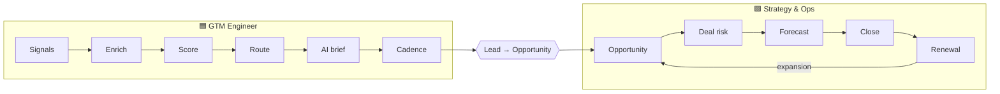

# Architecture

## The revenue lifecycle, split at one handoff



The handoff is lead conversion: the SQL becomes a stage-1 opportunity with `Originating_Lead__c` set. Everything before it is 🟦; everything after is 🟩. Field ownership is defined in the [object model](../../shared_core/data_model/salesforce-object-model.md).

## Systems

The CRM is the hub and wins every conflict. The enrichment tool writes only to empty or suffixed fields. The sequencer and dialer log activity to the CRM; the forecasting tool reads from the CRM. AI output never writes to a CRM field without passing the human-review policy. Full map: [stack map](../../shared_core/context/gtm-stack-map.md).

## Code layout

```
config/company.yaml        the Sardine config (segments, personas, stack, stages, weights, consumption)
config/waterfall_rules.yaml enrichment waterfall rules
shared_core/               config loader, DQ monitor, AI governance, metrics + SQL runner, schemas
gtm_engineer/              scoring, routing, lifecycle, AI research, funnel, capacity,
                           enrichment (waterfall engine, lead-to-account matcher), integrations (webhook)
gtm_strategy_ops/          pipeline, forecasting, deal risk, renewals, partner + forecasting-tool specs
prototypes/                unrefactored scripts, promoted into a track once hardened
docs/                      overview, specs, playbooks, examples
scripts/                   sample-data generator, new-company scaffolder
tests/                     unit tests, SQL/Python parity tests, prompt evals
```

## Data flow in the demo

`scripts/generate_sample_data.py` (seeded) → `sample_data/*.csv` → each script reads via `shared_core.config` → outputs to `outputs/` (git-ignored). SQL runs on an in-memory SQLite warehouse built from the same CSVs, with the semantic layer loaded first. In production the same code would read from a warehouse sync of the CRM and forecasting-tool snapshots.
