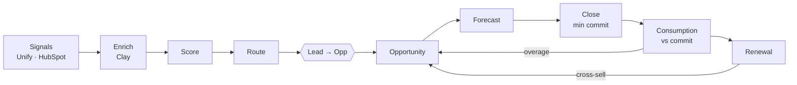

# Architecture

**The handoff** is lead conversion: everything before it is 🟦, everything after it is 🟩. Field ownership is in the [object model](https://github.com/peytonbackus-spec/sardine-gtm-revops-toolkit/blob/main/shared_core/data_model/salesforce-object-model.md).

**Systems.** Salesforce is the hub and wins every conflict. HubSpot owns marketing fields, and Salesforce owns lifecycle stage. Clay and Unify write to their own field namespaces. n8n runs cross-tool automation, with workflows exported to Git. Usage and billing data come back to the Account. AI output never writes to a record without passing the human-review policy. Map: [gtm-stack-map.md](https://github.com/peytonbackus-spec/sardine-gtm-revops-toolkit/blob/main/shared_core/context/gtm-stack-map.md).

**The demo.** A seeded generator writes `sample_data/*.csv`, and every module reads it through `shared_core.config`. SQL runs on an in-memory SQLite warehouse with the semantic layer loaded first. In production the same code reads a warehouse sync of Salesforce, HubSpot and billing.
