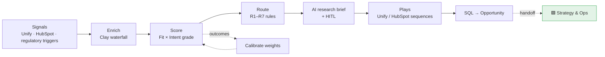

# 🟦 GTM Engineer Track

 

**Role scope:** the data, AI workflows, systems and operating processes that drive demand generation through qualified pipeline development. Everything from the first signal to an accepted opportunity. The handoff to the 🟩 Strategy & Ops track is lead conversion (see the [object model](../shared_core/data_model/salesforce-object-model.md)).

> **At Sardine** this track is the "internal GTM Engineer" half of the Revenue Operations Manager role: signals (Unify, HubSpot), enrichment (Clay, ZoomInfo), orchestration (n8n) and Salesforce lead management.



## What's here

| Capability | Artifact | Type |
|---|---|---|
| Lead-to-opportunity funnel analytics | [`funnel_analytics/funnel_report.py`](funnel_analytics/funnel_report.py), [`sql/lead_funnel.sql`](funnel_analytics/sql/lead_funnel.sql) | ▶️ runnable |
| Funnel dashboards (volume, velocity, pipeline value, penetration) | [`funnel_analytics/dashboard-spec.md`](funnel_analytics/dashboard-spec.md) | 📐 spec |
| Lead scoring (Fit × Intent) and calibration against outcomes | [`score_leads.py`](lead_scoring/score_leads.py), [`calibrate_scoring.py`](lead_scoring/calibrate_scoring.py) | ▶️ runnable |
| Routing with an explanation on every decision | [`route_leads.py`](lead_routing/route_leads.py), [CRM flow spec](lead_routing/salesforce-routing-flow-spec.md) | ▶️ + 📐 |
| Lifecycle, SLAs, qualification standard | [Lifecycle spec](lead_lifecycle/lead-lifecycle-spec.md), [`lifecycle_sla.py`](lead_lifecycle/lifecycle_sla.py) | 📐 + ▶️ |
| Enrichment waterfall engine (rules + provider cascade) | [`enrichment/rules_engine.py`](enrichment/rules_engine.py), [`config/waterfall_rules.yaml`](../config/waterfall_rules.yaml) | ▶️ tested |
| Lead-to-account matching (domain, fuzzy name, confidence tiers) | [`enrichment/l2a_matcher.py`](enrichment/l2a_matcher.py) | ▶️ tested |
| Enrichment API (FastAPI webhook over the waterfall) | [`integrations/webhook.py`](integrations/webhook.py) | ▶️ tested |
| Enrichment waterfall design (columns, cost guardrails, quality checks) | [spec](platform_admin/enrichment-waterfall.md) | 📐 spec |
| Engagement layer (cadences, dialer, chat, social selling) | [spec](platform_admin/engagement-layer.md) | 📐 spec |
| AI account research with prompts, evals and human review | [`ai_research/`](ai_research/account_research.py) + [🟪 governance](../shared_core/ai_governance/README.md) | ▶️ tested in CI |
| Data-quality monitoring | [🟪 `dq_monitor.py`](../shared_core/data_quality/dq_monitor.py) | ▶️ shared |
| SDR capacity planning | [`capacity_model.py`](sdr_capacity/capacity_model.py) | ▶️ runnable |
| ICP segmentation and personas | [🟪 ICP & personas](../shared_core/context/icp-and-personas.md), [`config/company.yaml`](../config/company.yaml) | 📐 + config |
| First 90 days | [plan](../FIRST_90_DAYS.md) | 📐 plan |

▶️ runs on the synthetic data in `sample_data/` · 📐 design spec / config

## Run it

```bash
python -m gtm_engineer.lead_scoring.score_leads          # grade every lead (A1–D4) + recommendation
python -m gtm_engineer.lead_scoring.calibrate_scoring    # does the score predict conversion? weight suggestions
python -m gtm_engineer.lead_routing.route_leads          # R1–R7 routing with reasons
python -m gtm_engineer.lead_lifecycle.lifecycle_sla      # MQL→SAL SLA by SDR and source; stuck leads
python -m gtm_engineer.ai_research.account_research      # AI briefs → HITL review queue
python -m gtm_engineer.funnel_analytics.funnel_report    # cohort funnel, velocity, penetration, outlook, narrative
python -m gtm_engineer.sdr_capacity.capacity_model       # headcount math from pipeline target
```
