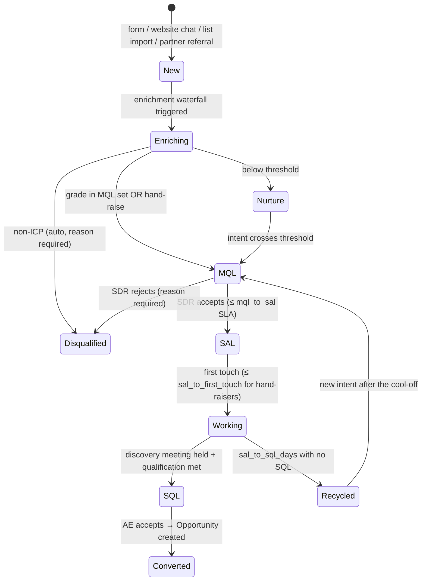

# Lead Lifecycle Specification

**Scope:** own lead capture, enrichment, scoring, routing and disqualification; define qualification standards across Marketing, SDRs and Account Executives; agree data standards and service levels.

This is the contract between Marketing, SDRs and AEs. Each status has an entry rule, an owner, an SLA and an exit rule. The CRM (Salesforce) enforces the entry rules (validation rules plus record-triggered flows). [`lifecycle_sla.py`](lifecycle_sla.py) measures the SLAs. SLA values come from `lead_lifecycle.sla_hours` in the company config.

| Status | Entry rule | Owner | SLA | Exit |
|---|---|---|---|---|
| **New** | Record created from any source; `Lead_Source` required | Marketing Ops | Enrichment starts in <5 min | → Enriching |
| **Enriching** | Waterfall running (see [waterfall spec](../platform_admin/enrichment-waterfall.md)) | GTM Engineering (system) | <15 min | Scored → MQL / Nurture / Disqualified |
| **MQL** | `Lead_Grade__c` in `lead_scoring.mql_grades` **or** a recent hand-raise signal with fit ≥ C | SDR (routed) | Accept or reject within the MQL→SAL SLA | → SAL or Disqualified |
| **SAL** | SDR accepted; `Product_Interest__c` required | SDR | First touch within the SLA for hand-raisers, same day otherwise | → Working |
| **Working** | Cadence active in Unify / HubSpot Sequences (assumed) | SDR | `sal_to_sql_days` to reach SQL | → SQL or Recycled |
| **SQL** | Meeting held **and** qualification standard met (below) | SDR → AE | AE accepts within 2 business days | → Converted |
| **Converted** | Opportunity created at Stage 1; `Originating_Lead__c` stamped | AE | — | Hand-off to [opportunity lifecycle](../../gtm_strategy_ops/opportunity_lifecycle/stage-definitions.md) 🟩 |
| **Recycled** | No SQL in window or "not now" | Marketing | `recycle_after_days` cool-off | → MQL on new intent |
| **Disqualified** | `Disqualify_Reason__c` required | SDR / system | — | Feeds [scoring calibration](../lead_scoring/calibrate_scoring.py) |

## Qualification standard for SQL (shared by Marketing, SDR and AE)

An SQL needs **all four**. Each one is a field, so it can be reported on:

1. **Fit:** ICP segment (not `other`) and fit grade A–B.
2. **Use case:** a named problem that one of Sardine's product lines solves (`Product_Interest__c`).
3. **Persona:** a meeting held with an economic buyer or champion persona (see [personas](../../shared_core/context/icp-and-personas.md)).
4. **Timing or trigger:** a known initiative, vendor contract end, regulatory driver or loss event, recorded in `SQL_Trigger__c`.

AEs can reject an SQL within 2 days with a reason. Rejection rate by SDR and by source shows up in the weekly funnel report. That's how "qualified" stays a shared standard instead of an argument.

## Disqualification reasons (picklist, required)

Configured in `lead_lifecycle.disqualify_reasons`. Example: `Not ICP` · `Competitor` · `Student/Job Seeker` · `Existing Open Opp` · `No Use Case` · `Bad Data` · `Duplicate`

Required because calibration depends on them. If 30% of A-grade leads are disqualified as "No Use Case", the fit model is wrong and the weights need to change.
