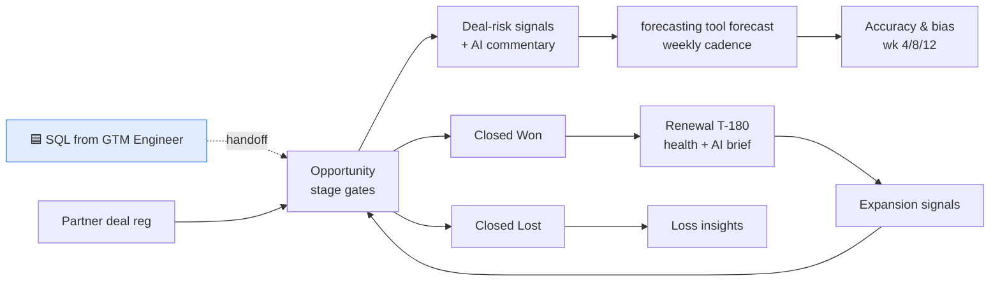

# 🟩 GTM Strategy & Operations Track

 

**Role scope:** the data systems and processes that govern the sales pipeline lifecycle, combining GTM operations, analytics and engineering. From opportunity creation through forecast, close and renewal. It receives the handoff from the 🟦 GTM Engineer track at lead conversion (see the [object model](../shared_core/data_model/salesforce-object-model.md)).

> **At Sardine** this track is the RevOps half of the Revenue Operations Manager role, plus the cash end of lead-to-cash: consumption against minimum commit, overage-driven expansion and renewals.



## What's here

| Capability | Artifact | Type |
|---|---|---|
| Commercial data model and dashboard architecture, pipeline-to-renewal | [🟪 semantic layer](../shared_core/metrics/sql/semantic_layer.sql), [dashboard spec](pipeline_analytics/dashboard-spec.md) | ▶️ + 📐 |
| Reporting: coverage, conversion, forecast accuracy, retention | [`pipeline_report.py`](pipeline_analytics/pipeline_report.py), [`forecast_accuracy.py`](forecasting/forecast_accuracy.py), [`renewal_signals.py`](renewals/renewal_signals.py) | ▶️ runnable |
| Views by region, product, source, owner | `pipeline_report.open_pipeline_by()` / `win_rates_by()`, [`pipeline_coverage.sql`](pipeline_analytics/sql/pipeline_coverage.sql) | ▶️ runnable |
| Multi-touch / W-shaped attribution | [`attribution/`](../shared_core/metrics/sql/attribution/) | 📐 SQL |
| Data-quality monitoring across CRM and forecasting tool | [🟪 `dq_monitor.py`](../shared_core/data_quality/dq_monitor.py) (rules O01–O08), [sync checks](forecast_tool_admin/forecast-tool-configuration-spec.md#sync--data-quality) | ▶️ + 📐 |
| Pipeline and forecast narratives | `pipeline_report.narrative()`, [forecast commentary prompt](ai_deal_risk/prompts/forecast_commentary.md) | ▶️ runnable |
| AI workflows: deal-risk, forecast commentary, renewal signals | [`deal_risk.py`](ai_deal_risk/deal_risk.py), [`renewal_signals.py`](renewals/renewal_signals.py) | ▶️ tested in CI |
| Prompts, outputs, governance for AI | [Prompts](ai_deal_risk/prompts/), [eval cases](ai_deal_risk/evals/deal_risk_cases.json), [🟪 AI standard](../shared_core/ai_governance/README.md) | ▶️ tested in CI |
| Forecast cadence, categories, accuracy measurement | [Forecast cadence](forecasting/forecast-cadence.md), [`forecast_accuracy.py`](forecasting/forecast_accuracy.py) | ▶️ + 📐 |
| Opportunity lifecycle and data standards | [Stage definitions](opportunity_lifecycle/stage-definitions.md), [🟪 object model](../shared_core/data_model/salesforce-object-model.md) | 📐 spec |
| Forecasting-tool administration and CRM integration | [Configuration spec](forecast_tool_admin/forecast-tool-configuration-spec.md) | 📐 spec |
| Renewals and partner-sourced opportunity workflows | [Renewal process](renewals/renewal-process.md), [partner workflow](partner_ops/partner-sourced-opportunity-workflow.md) | 📐 spec |
| Closed-lost and churn insights | [`closed_lost_analysis.py`](renewals/closed_lost_analysis.py), [taxonomy](renewals/closed-lost-and-churn-taxonomy.md) | ▶️ + 📐 |
| Deal frameworks (MEDDPICC inspection, health scoring, territory) | [`docs/playbooks/`](../docs/playbooks/) | 📐 playbooks |
| Consumption vs minimum commit: overage and shelfware | [`commit_burndown.py`](consumption/commit_burndown.py), [lead-to-cash map](consumption/lead-to-cash.md) | ▶️ + 📐 |
| First 90 days | [plan](../FIRST_90_DAYS.md) | 📐 plan |

▶️ runs on the synthetic data in `sample_data/` · 📐 design spec / config

## Run it

```bash
python -m gtm_strategy_ops.pipeline_analytics.pipeline_report   # coverage, segmentation, win rates, aging, narrative
python -m gtm_strategy_ops.forecasting.forecast_accuracy         # wk 4/8/12 accuracy + bias by region
python -m gtm_strategy_ops.ai_deal_risk.deal_risk                # risk signals → AI commentary → HITL queue
python -m gtm_strategy_ops.renewals.renewal_signals              # renewal health, GRR forecast, expansion signals
python -m gtm_strategy_ops.renewals.closed_lost_analysis         # loss reasons → owner actions
python -m gtm_strategy_ops.consumption.commit_burndown          # usage vs minimum commit: overage + shelfware
```
