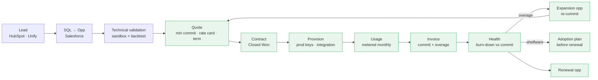

# Lead-to-Cash for Consumption Pricing

 

Both Sardine postings ask for automation "across the lead-to-cash lifecycle". With consumption pricing (a minimum monthly commit drawn down by usage, overages billed monthly `[VERIFY]`), the cash half is where most of the manual work and missed signals hide. This page maps each step, its system, the handoff that breaks, and the automation that fixes it.

| # | Step | System | What breaks without automation | Automation (n8n / Salesforce) |
|---|---|---|---|---|
| 1 | Lead → SQL | HubSpot, Unify, Salesforce | Lifecycle stage disagrees between HubSpot and Salesforce; signal-sourced leads go unrouted | One lifecycle owner (Salesforce); routing rules R1–R7 ([route_leads.py](../../gtm_engineer/lead_routing/route_leads.py)) |
| 2 | Technical validation | Sardine sandbox | No record of which modules were tested or how the backtest performed | Sandbox-request form creates a POC record on the opp; backtest results attached before stage 4 |
| 3 | Quote | CPQ | Free-text pricing; commit sized by gut | Quote template with rate card per module; commit sized from the backtest volume × rate, with an approval threshold on discount |
| 4 | Contract | Salesforce | Commit, term and rate card live only in the PDF | Closed Won requires `Monthly_Commit__c`, `Term_Months__c`, `Modules__c`; the renewal opp is auto-created (term end − 120 days) |
| 5 | Provision | Platform + Salesforce | Sales doesn't know when a customer went live; the ramp clock starts unknown | Go-live date from the platform writes to the Account (`Prod_Live_Date__c`); it starts the ramp window |
| 6 | Usage | Platform → warehouse | Usage is visible only to Finance at invoice time | Monthly usage by module written back to the Account (`Usage_3mo__c`, `Utilization_3mo__c`) |
| 7 | Invoice | Billing | Overages billed but nobody in Sales hears about them | Overage over threshold creates an Expansion opp and a task for the owner (n8n), with Slack alert |
| 8 | Health | Salesforce + warehouse | Under-use found at renewal, when it's too late | [commit_burndown.py](commit_burndown.py) flags shelfware after the ramp window, and the CSM gets an adoption-plan task |
| 9 | Renewal | Salesforce | Renewal priced off last year's commit, not actual usage | Renewal opp pre-filled with trailing-12-month usage and a suggested re-commit |

## Data model additions (Salesforce)

| Object | Field | Type | Source |
|---|---|---|---|
| Opportunity | `Monthly_Commit__c` | Currency | CPQ |
| Opportunity | `Rate_Card_Version__c` | Text | CPQ |
| Opportunity | `Modules__c` | Multi-select (Fraud / KYC / KYB / AML / Sanctions…) | CPQ |
| Account | `Prod_Live_Date__c` | Date | Platform |
| Account | `Usage_3mo__c`, `Commit_3mo__c`, `Utilization_3mo__c` | Currency / % | Warehouse (nightly) |
| Account | `Consumption_Flag__c` | Picklist: Overage / Shelfware / Ramping / OK | commit_burndown logic |

## Metrics this unlocks

- **Net revenue retention computed on billed revenue, not just commit.** Overage counts as expansion.
- **Time to first production transaction** after Closed Won (ramp speed).
- **Commit accuracy:** actual 3-month utilization ÷ quoted commit, by segment. It shows whether AEs are over- or under-sizing deals.
- **Expansion pipeline sourced from overage**, as a share of total expansion pipeline.
