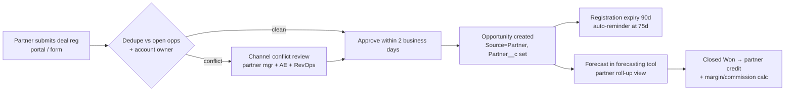

# Partner-Sourced Opportunity Workflow

**Scope:** design partner-sourced opportunity workflows (and, with the [renewal process](../renewals/renewal-process.md), the rest of the post-sale loop).

**Why this matters:** when resellers, technology partners and marketplaces bring deals (see `partners` in config), buyers in partner-led segments often buy through their incumbent provider. Without a clean partner workflow, partner deals show up as AE-sourced, partner revenue is under-credited, and channel conflict goes unmanaged.

## Definitions

| Term | Definition | Field |
|---|---|---|
| **Partner-sourced** | The partner brought the opportunity (deal registration approved) | `Source__c = Partner` + `Partner__c` |
| **Partner-influenced** | Sardine sourced it; the partner materially helped (intro, integration, co-sell) | `Partner_Influence__c` (lookup) |
| **Resale** | The partner holds the paper (e.g. a reseller) | `Route_To_Market__c = Resale` |
| **Referral** | The partner refers; Sardine contracts directly | `Route_To_Market__c = Direct-Referral` |

## Flow

## Rules

1. **First valid registration wins** for 90 days. Extension needs proof of activity.
2. **Open-opportunity conflict:** if Sardine already has an open opportunity at stage 2 or later, the registration is rejected as partner-sourced but can be approved as partner-influenced.
3. **The 🟦 GTM Engineer's routing hands over here:** partner-referral leads route to the partner manager (rule R4 in [`route_leads.py`](../../gtm_engineer/lead_routing/route_leads.py)) and convert with `Partner__c` populated.
4. **Reporting:** partner-sourced pipeline, win rate and cycle get their own cut in the [pipeline report](../pipeline_analytics/pipeline_report.py) (the `source` dimension) and in Salesforce Forecasts (assumed)'s partner roll-up.
5. **Data quality:** a partner-sourced opportunity with no partner named is flagged (DQ rule O07).

## Open questions for week one

- Does resale run through the company's CRM, or does the partner report bookings after the fact?
- Is there a partner portal (PRM), or are registrations handled by email today?
- How are partner bookings counted against AE quota (full credit, split or overlay)?
