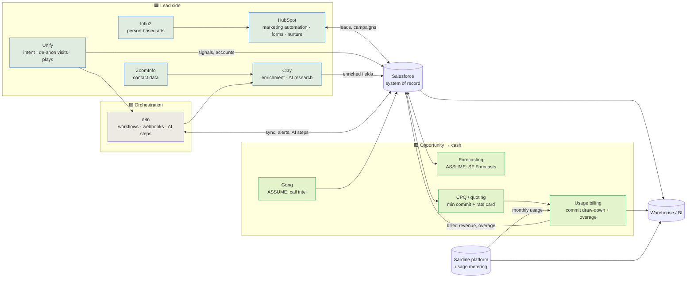

# GTM Stack Map

Every tool in Sardine's GTM stack: what it's the system of record for, and where data flows. Salesforce is the hub. Tools marked **[POSTING]** are named in Sardine's RevOps Manager, GTM Engineer or Marketing Ops postings. Tools marked **[ASSUME]** are placeholders to confirm in week one. For what to keep, consolidate or replace, see the [stack evaluation](gtm-stack-evaluation.md).

| Tool | Status | System of record for | Owner |
|---|---|---|---|
| **Salesforce** | [POSTING] | Accounts, contacts, leads, opportunities, contracts, forecast categories | RevOps |
| **HubSpot** | [POSTING] | Marketing contacts, forms, campaigns, nurture, website analytics events | Marketing Ops, with RevOps owning the sync |
| **Unify** | [POSTING] | Website de-anonymization, intent signals, outbound plays | RevOps / GTM Engineering |
| **Clay** | [POSTING] | Enrichment waterfalls, signal detection, AI research columns | RevOps / GTM Engineering |
| **n8n** | [POSTING] | Workflow automation: webhooks, cross-tool sync, AI steps, Slack alerts | RevOps / GTM Engineering |
| **Zapier / Workato / Tray.io** | [POSTING] (named as middleware experience) | Not assumed in use; see the evaluation | n/a |
| **ZoomInfo** | [POSTING] (Marketing Ops role) | Contact and firmographic data | Marketing Ops |
| **Influ2** | [POSTING] (Marketing Ops role) | Person-based advertising | Marketing |
| **Google Analytics** | [POSTING] (Marketing Ops role) | Web analytics | Marketing |
| **CPQ** | [POSTING] (GTM Engineer role names CPQ) | Quotes: minimum monthly commit, rate card, term | RevOps |
| **Usage billing** | [ASSUME] | Monthly draw-down against commit, overage invoices | Finance, with RevOps owning the CRM link |
| **Forecasting** | [ASSUME] Salesforce Forecasts | Forecast submissions and snapshots | RevOps |
| **Gong** | [ASSUME] | Call recordings, deal signals | Sales / RevOps |
| **Cursor, Claude, v0** | [POSTING] | Internal tool building ("vibe coding") | RevOps |

## Integration rules

1. **Salesforce wins conflicts.** Other tools write to their own field namespace (e.g. `Clay_*`, `Unify_*`) and a mapped field updates only when the source's confidence beats the current value. See the [enrichment waterfall](../../gtm_engineer/platform_admin/enrichment-waterfall.md).
2. **HubSpot ↔ Salesforce has one owner per field.** Lifecycle stage is set in Salesforce and synced to HubSpot, never the reverse. Marketing attribution fields flow the other way.
3. **Every automation is code or config in Git.** n8n workflows are exported as JSON and reviewed like code. The GTM Engineer posting asks for "configuration as code".
4. **Usage and billing data come back to the account.** Commit, trailing usage and overage land on the Account and Opportunity, so AEs and CSMs see consumption without opening the billing system. That's the input to the [commit burn-down](../../gtm_strategy_ops/consumption/commit_burndown.py).
5. **AI steps follow the governance standard.** PII is stripped, outputs validated, and a human reviews anything that writes to a record. See [AI governance](../ai_governance/README.md).
