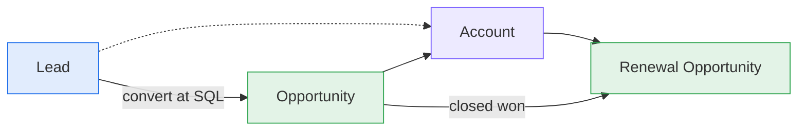

# CRM Object & Field Model (Salesforce)

This is the boundary between the two roles. The **GTM Engineer** owns everything up to lead conversion. **Strategy & Ops** owns everything from opportunity creation to renewal. Lead conversion, where the SQL becomes an opportunity, is the handoff. Both roles share the account object and the data-quality rules.

## Lead (🟦 GTM Engineer)

| Field (API name) | Type | Written by | Purpose |
|---|---|---|---|
| `Status` | Picklist | Flow + SDR | New → Enriching → MQL → SAL → Working → SQL → Converted / Recycled / Disqualified |
| `Segment__c` | Picklist | Enrichment tool → Flow | Segment key from the company config |
| `Persona__c` | Picklist | Enrichment-tool title normaliser | Persona key; drives fit points |
| `Fit_Score__c` | Number(3) | Scoring job | 0–100 firmographic and persona fit |
| `Intent_Score__c` | Number(3) | Scoring job | 0–100 decayed engagement |
| `Lead_Grade__c` | Text(2) | Scoring job | e.g. `A1`; drives MQL |
| `Product_Interest__c` | Picklist | Form / website chat / SDR | A product-line key from config (example: `core` or `addon`) |
| `Intent_Signals__c` | Long text | Enrichment tool | Signal log `signal@date` |
| `MQL_Date__c`, `SAL_Date__c`, `SQL_Date__c` | DateTime | Flow (stamp on status change) | Funnel velocity and SLA timers |
| `Disqualify_Reason__c` | Picklist | SDR (required on DQ) | Feeds scoring calibration |
| `SQL_Trigger__c` | Picklist | SDR (required at SQL) | Timing driver: initiative, vendor contract end, regulatory driver, loss event |
| `Routing_Pod__c`, `Routing_Rule__c` | Text | Routing job | Audit trail of why a lead went where it did |
| `Partner__c` | Lookup(Account) | Partner portal / form | Partner attribution starts here |

**Validation rules:** `Disqualify_Reason__c` is required when Status = Disqualified. `Product_Interest__c` is required at SAL. `SQL_Trigger__c` is required at SQL. The status can't jump from New to SQL.

## Opportunity (🟩 Strategy & Ops)

| Field (API name) | Type | Written by | Purpose |
|---|---|---|---|
| `Type` | Picklist | AE / conversion | New Logo, Expansion, Renewal |
| `Product_Line__c` | Picklist | AE | A product-line key from config; match the company's reported segments |
| `StageName` | Picklist | AE | See [stage definitions](../../gtm_strategy_ops/opportunity_lifecycle/stage-definitions.md) |
| `ForecastCategoryName` | Picklist | AE via Salesforce Forecasts (assumed) | Pipeline / Best Case / Commit / Closed / Omitted |
| `Source__c` | Picklist | Conversion / AE | Marketing, SDR, AE, Partner |
| `Originating_Lead__c` | Lookup(Lead) | Conversion | Funnel attribution back to the lead |
| `Partner__c` | Lookup(Account) | AE / partner manager | Partner-sourced and influenced revenue |
| `Economic_Buyer_Engaged__c` | Checkbox | AE (Gong (assumed) assist) | Required for stage 4 exit |
| `POC_Status__c` | Picklist | SE | Not Started / In Progress / Passed / Failed / N/A |
| `Security_Review__c` | Picklist | AE | Not Started / In Progress / Complete |
| `Competitor__c` | Picklist | AE | Primary competitor |
| `Closed_Lost_Reason__c` | Picklist | AE (required on loss) | See [closed-lost taxonomy](../../gtm_strategy_ops/renewals/closed-lost-and-churn-taxonomy.md) |
| `Stage_Entered_Date__c` | Date | Flow | Days-in-stage risk signal |
| `AI_Risk_Level__c`, `AI_Risk_Reasons__c` | Picklist / Text | Deal-risk job (after review) | Written only after HITL acceptance |

**Validation rules:** an opportunity can't move to stage 4+ without `Economic_Buyer_Engaged__c`. Commit isn't allowed in stage 1–2. `Closed_Lost_Reason__c` is required on Closed Lost. A partner-sourced opportunity needs `Partner__c`.

## Account (🟪 Shared)

| Field | Written by | Purpose |
|---|---|---|
| `Segment__c`, `Region__c`, `NumberOfEmployees` (add size fields your segments need) | Enrichment tool (empty-field-only) | Routing, scoring, segmentation |
| `Customer_Status__c` | Billing sync | Prospect / Customer / Former |
| `Products_Owned__c` | Billing sync | Expansion whitespace (cross-sell between product lines) |
| `Account_Owner` | Territory rules | Expansion routing; overrides the SDR pool |
| `Partner_Channel__c` | Partner ops | Named channel partner(s) |

## Field governance

- Each field has exactly one writing system. Enrichment-tool fields carry a suffix or follow the empty-field-only rule.
- New fields need a named owner, a purpose and a report that uses them. If nothing reads a field, don't create it.
- Picklist values are mirrored in the company config so code and CRM can't drift. The data-quality monitor (rule L04) checks this.
